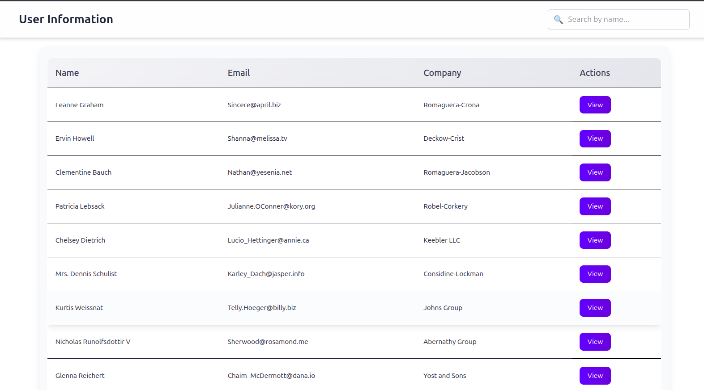

# Users Info Task

A single-page application (**SPA**) for browsing a list of users with search functionality and detailed information view.

## Features

- Fetches users from public API:  
  [https://jsonplaceholder.typicode.com/users](https://jsonplaceholder.typicode.com/users)
- Display options:
  - cards on mobile devices  
  - table on desktops
- **View** button opens a modal with detailed info (address, phone, website, company).
- Modal can be closed by:
  - clicking the **×** button  
  - clicking outside the modal  
  - pressing the `Escape` key
- User search by name (search bar in the header).
- Responsive design powered by **Tailwind CSS**.

---

## 📸 Screenshot



## Tech Stack

- [Vite 4.1](https://vitejs.dev/) — bundler
- [React 18](https://react.dev/) — UI library
- [TypeScript](https://www.typescriptlang.org/) — type safety
- [Tailwind CSS](https://tailwindcss.com/) — styling

---

## Getting Started

### 1. Clone the repository

```bash
git clone https://github.com/yaroprof/users-info-task.git
cd users-info-task
